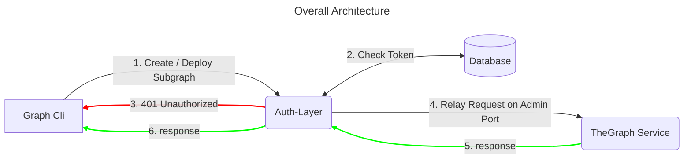

# Readme

This is a token verification auth-layer-proxy for Hedera-The-Graph implementation that will allow a node operator to publish a secured `admin port` of the-graph deployment for Hedera.

Uses EnvoyProxy as a reverse proxy that handles the token verification. The token is verified using the OAuth 2.0 token server and the token claims are validated for the required roles and subgraph access.


More information on the **Authorization Layer** can be found [here](https://github.com/hashgraph/hedera-the-graph/blob/main/docs/design/auth-layer.md)

## Overview

This is an implementation of EnvoyProxy filters for authentication and authorization. It is a custom config with http filters using Lua scripts for performing the following actions: 

1. JSON Validation
2. Token Extraction
4. Payload Params Extraction
5. Token Validation using JWT and Instrospect endpoint
6. Proxy Routing Configuration (using EnvoyProxy itself)

it includes a Dockerfile for building the image and a docker-compose file for running the container.

## Pre-requisites

### OAUTH 2.0 Token Server
This auth-token validation proxy layer relies on an OAuth 2.0 token server for token issuace and validation. The token server should be able to issue and validate the token using the `client_id` and `client_secret` provided in the `.env` file.

So make sure to have a token server running that is previously configured with a Client ID and Client Secret, and the `/token` and `/token/introspection` endpoints are accessible.

### Token structure

Make sure that the access token has the following claims:
- realm_access.roles: A list of roles that the user has. The roles are used to determine the access level of the user.
- subgraph_access: A list of subgraph names that the user has access to. The subgraph names are used to determine the access level of the user.
- active: A boolean value that indicates if the user is active or not.
- email_verified: A boolean value that indicates if the user's email is verified or not.
- email: The email of the user.
  
  ```json
  {
    "exp": 1711427468,
    "iat": 1711391468,
    "jti": "2fab170f-beb1-4821-acb4-ac19a71c9abe",
    "iss": "http://host.docker.internal:8080/realms/HederaTheGraph",
    "aud": "account",
    "sub": "f60ffb03-d17f-4aa2-a34a-2c4891059c3c",
    "typ": "Bearer",
    "azp": "htg-auth-layer",
    "session_state": "79fbb78a-3279-463e-8ee0-6ab37e06bcc2",
    "acr": "1",
    "allowed-origins": [
        "/*"
    ],
    "realm_access": {
        "roles": [
            "default-roles-hederathegraph",
            "subgraph_remove",
            "subgraph_create",
            "subgraph_deploy",
            "offline_access",
            "uma_authorization",
            "subgraph_resume",
            "subgraph_pause"
        ]
    },
    "scope": "profile subgraph_access email",
    "subgraph_access": "<CSV of subgraph names>",
    "email_verified": true,
    "active": true,
    "email": "user1@gmail.com",
    "client_id": "htg-auth-layer"
  }
  ```

For instructions on how to set-up the Auth Provider using KeyCloak, refer to the `Auth-Layer-Server` [README](https://github.com/hashgraph/hedera-the-graph/tree/main/charts/auth-layer-server)

## Usage

### Build the image

```bash
docker build -t envoy-auth-proxy .
```

#### On Mac M1

```bash
docker build --platform linux/amd64 -t envoy-auth-proxy .
```

### Configure the environment

Add Postgres or Redis credentials to the .env file

```bash
# EnvoyProxy Configuration
SERVICE_TYPE=LOGICAL_DNS
SERVICE_ADDRESS=host.docker.internal
SERVICE_PORT=8020
ENVOY_ADMIN_PORT=15000
PROXY_PORT=10000

# OAuth
CLIENT_ID=<clientId>
CLIENT_SECRET=<client_secret>
TOKEN_INTROSPECTION_URL=http://host.docker.internal:8080/realms/HederaTheGraph/protocol/openid-connect/token/introspect
```

| Parameter | Description | Default |
| --------- | ----------- | ------- |
| `SERVICE_TYPE` | EnvoyProxy Configuration downstream address type, can be `LOGICAL_DNS` for a FQDN or `STATIC` when using an IP address | `LOGICAL_DNS` |
| `SERVICE_ADDRESS` | EnvoyProxy Configuration downstream address, can be either a FQDN or an IP | `host.docker.internal` |
| `SERVICE_PORT` | EnvoyProxy Configuration downstream port, this would be the admin port on TheGraph indexer node | `8020` |
| `ENVOY_ADMIN_PORT` | EnvoyProxy Configuration admin port | `15000` |
| `PROXY_PORT` | EnvoyProxy Configuration proxy port | `10000` |
| `CLIENT_ID` | OAuth Client ID, provided by the auth server | `htg-auth-layer` |
| `CLIENT_SECRET` | OAuth Client Secret, provided by the auth server | `` |
| `TOKEN_INTROSPECTION_URL` | OAuth Token Introspection URL, provided by the auth server | `http://host.docker.internal:8080/realms/HederaTheGraph/protocol/openid-connect/token/introspect` |


### Configure the details of the service to be proxied on the envoy.yaml
EnvoyProxy needs a configuration file to run, the configuration will be created or updated on the container start, by the `scripts/start-envoy.sh` script, which will create or replace the `envoy-config.yaml` file using the template `configs/envoy-auth-template.yaml` and the environment variables.

It will also print out the configuration as part of the logs for debugging and verification purposes.

It is important to note that if the downstream service that we are protecting (in this case TheGraph) will be accessed by the proxy using a FQDN, the `SERVICE_TYPE` should be set to `LOGICAL_DNS` and the `SERVICE_ADDRESS` should be set to the FQDN of the service. Otherwise, if the downstream service is accessed by the proxy using an IP address, the `SERVICE_TYPE` should be set to `STATIC` and the `SERVICE_ADDRESS` should be set to the IP address of the service.

#### Configuration Environment Variables by using DNS or FQDN for the service to be proxied.

```bash
SERVICE_TYPE=LOGICAL_DNS
SERVICE_ADDRESS=host.docker.internal
```

#### Configuration Environment Variables by using IP Address for the service to be proxied.

```bash
SERVICE_TYPE=STATIC
SERVICE_ADDRESS=10.100.1.1
```


### Run the container


**Start the container:**

```bash
docker-compose up
```

### Test the service

```bash
curl --location 'http://localhost:10000' \
--header 'Content-Type: application/json' \
--header 'Authorization: Bearer 12345' \
--data '{
    "jsonrpc": "2.0",
    "id": "2",
    "method": "deploy_subgraph",
    "params": {
        "name": "test"
    }
}'
```


## Testing

The tests are written using lunatest and can be run using the following command:

Make sure to have installed the following prerequisites:
1. lua
2. luarocks

Install the following luarocks packages:

```bash
luarocks install lua-cjson
luarocks install luasocket
luarocks install lunatest
luarocks install luacov
luarocks install luacov-console
```

Open a terminal and navigate to the folder containing the `tests` folder and run the following command:

```bash
lua test.lua
```

to show the coverage report, run the following command:

```bash
luacov
luacov-console ../filters/ 
luacov-console ../filters/ -s
```