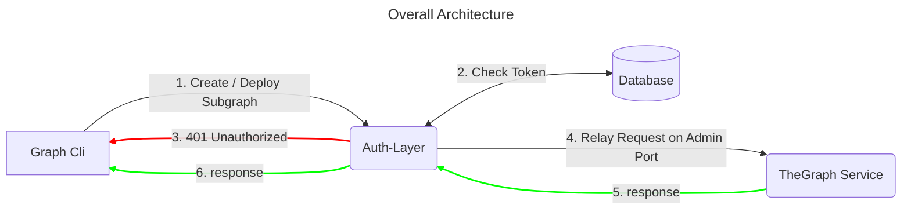

# Readme

This is a token verification auth-layer-proxy for Hedera-The-Graph implementation that will allows a node operator to publish a secured `admin port` of the-graph deployment for hedera.

Uses EnvoyProxy as a reverse proxy that handles the token verification. The token is verified using the OAuth 2.0 token server and the token claims are validated for the required roles and subgraph access.


More information on the **Authorization Layer** can be found [here](link)

## Overview

This is an implementation of EnvoyProxy filters for authentication and authorization. It is a custom config with http filters using Lua scripts for performing the following actions: 

1. JSON Validation
2. Token Extraction
3. Token Hashing
4. Payload Params Extraction
5. Token Validation using JWT
6. Proxy Routing Configuration (using EnvoyProxy itself)

it includes a Dockerfile for building the image and a docker-compose file for running the container.

## Pre-requisites

### OAUTH 2.0 Token Server
This auth-token validation proxy layer relies on an OAuth 2.0 token server for token issuace and validation. The token server should be able to issue and validate the token using the `client_id` and `client_secret` provided in the `.env` file.

So make sure to have a token server running that is previously configured with a Client ID and Client Secret, and the `/token` and `/token/introspection` endpoints are accessible.

### Token structure

Make sure that the access token has the following claims:
  
  ```json
  {
    "iss": "http://host.docker.internal:8080/realms/HederaTheGraph",
    "resource_access": {
        "htg-auth-layer": {
            "roles": [
                "subgraph_create",
                "subgraph_deploy"
            ]
        }
    },
    "subgraph_access": "<CSV of subgraph names>",
    "email_verified": true,
    "active": true,
    "email": "user1@gmail.com",
    "client_id": "htg-auth-layer"
  }
  ```

For instructions on how to set-up the Auth Provider using KeyCloak, refer to the `Auth-Layer-Server` [README](link)

## Usage

### Build the image

```bash

docker build -t envoy-auth-proxy .

```

### Configure the environment

Add Postgres or Redis credentials to the .env file

```
# OAuth
CLIENT_ID=<clientId>
CLIENT_SECRET=<client_secret>
TOKEN_INTROSPECTION_URL=http://host.docker.internal:8080/realms/HederaTheGraph/protocol/openid-connect/token/introspect

```

### Configure the details of the service to be proxied on the envoy.yam
Edit `envoy-auth.yaml` file with config needs, by default will be proxying/relaying the request to address: `host.docker.internal` and port `8020`

```yaml
  clusters:
  - name: local_service
    connect_timeout: 5s
    type: LOGICAL_DNS
    load_assignment:
      cluster_name: local_service
      endpoints:
      - lb_endpoints:
        - endpoint:
            address:
              socket_address:
                address: host.docker.internal
                port_value: 8020
```


### Run the container


**Start the container:**

```bash
docker-compose up
```

### Test the service

```bash
curl --location 'http://localhost:10000' \
--header 'Content-Type: application/json' \
--header 'Authorization: Bearer 12345' \
--data '{
    "jsonrpc": "2.0",
    "id": "2",
    "method": "deploy_subgraph",
    "params": {
        "name": "test"
    }
}'
```
