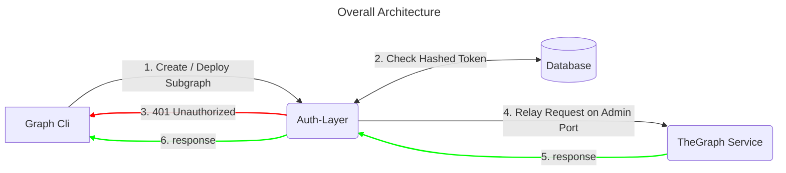

# Design Document: Hedera The Graph Auth Layer

## Context and Problem Statement
### Deployment of Sub-Graphs using Graph CLI
When a project intends to deploy a sub-graph it does so using the GraphCLI tool, this subsequently communicates with the provided IPFS API and the Graph-Node Service, however the Graph-Node Service does not validate the token provided by the GraphCLI tool, and instead relies on an Auth Layer that is part of the TheGraphStudio site, this Auth Layer is closed source and is not available for use by other projects.

**example of command:**
```bash
 graph deploy --node http://<graph_host>:<graph_port>/  <subgraph-name> --access-token <token>
```

### Graph-Node Requests
Since the GraphCli communicates with TheGraph Node using JSON-RPC 2.0, all the information needed for the validation of the token against the method being called and the params (name of graph, etc) is available in the JSON-RPC request. that means that conventional authentication methods that are created for REST APIs will not work for this use case. And there is a need for a custom solution.

**example of request:**
```http
POST / HTTP/1.1
Content-Length: 214
Content-Type: application/json; charset=utf-8
Accept: application/json
User-Agent: jayson-4.0.0
Authorization: Bearer 1234567890
Host: localhost:3000
Connection: close

{
    "method": "subgraph_deploy",
    "jsonrpc": "2.0",
    "params": {
        "name": "subgraph-example-hts",
        "ipfs_hash": "QmTsCPPVU6U5aRnawWCvWQa5zNtsrnDF95op1gTCUL8Put",
        "version_label": "0.0.4"
    },
    "id": "c771f120-fed4-4567-9c57-61d470a4b09c"
}
```


## Goals or Objectives
- Protect deployed sub-graphs from unauthorized access.
- Provide Teams with the ability to manage their sub-graphs without requiring intervention from the Engineering Team.

## Dependencies
- Postgres Database (for storing access tokens and their corresponding sub-graphs).
- NodeJS (for running the Auth Layer server).
- Docker (for running the Auth Layer server in a container).
- Kubernetes (for deploying the Auth Layer server to the cloud).
- Helm (for managing the Auth Layer server deployment).

## High Level Diagram



## Implementation

- Tokens will be stored on the DB as a hash, and the hash will be compared to the hash of the token provided by the user.
- There are 3 Admin Flows for the Auth Layer:
  - **Create Token:** Only Admins will be able to create tokens, the token will be stored in the DB as a hash. Admin will need to provide 
  - **Update Token:** Only Admins will be able to update tokens, the token will be stored in the DB as a hash, all the sub-graphs associated with the token will be updated with the new token hash.
  - **Delete Token:** Only Admins will be able to delete tokens, the token will be deleted from the DB, all the sub-graphs associated with the token will be deleted.
- There are 2 User Flows for the Auth Layer:
    - **Create Subgraph:** For creating a new subgraph, the user will need to provide a valid token with the `create` scope, when a subgraph is created, the same token will be stored in the DB associated with the subgraph that was created.
    - **Deploy Subgraph:** Only the user that created the subgraph will be able to deploy it, using the same token, the user will need to provide a valid token with the `deploy` scope.
- By default user tokens that have a `create` scope will be able to `deploy` subgraphs, but if Admin wants to restrict the creation of new subgraphs, it could just change the scope of the token to `deploy`. This is to simplify the process of creating new subgraphs for the Engineering Team, and to avoid having to create a new token for each subgraph.
- The Auth Layer will be implemented as a NodeJS server.
- The Auth Layer will be deployed as a Docker container.
- The Docker container will be deployed as part of the Helm chart for the Hedera The Graph Node (optionally), or as a separate Helm chart.

### Modules
- **Server Service (express):** sets up the server and the routes.
- **Database Service (pg):** connects to the database and provides methods for interacting with it.
- **TokenValidation Service (custom):** validates the token provided by the user, interacts with the DB Service to check if the token is valid, creates a new sub-graph as needed, or tokens in case of admin flows.
- **Proxy Service (axios):** relays the request to the The Graph Service, and returns the response to the user.
- **Middleware Service (custom):** Is the glue that connects all the services together, it validates the token, and relays the request to the Proxy Service.
- **DbSetup Service (custom):** Sets up the DB, creates the tables, and populates them with the initial data. (uses the DB Service for connection), this only needs to be run once, when the Auth Layer is first deployed.
- **Admin Service (custom):** Provides the admin flows for the Auth Layer, it is a separate service from the Middleware Service, and it is only accessible on the Admin Port (8022), this is to prevent any unauthorized access to the admin flows, by keeping it secured behind a different port and accesible only by the Engineering Team.


## Configuration
- DESTINATION_URL: The URL of the The Graph Service. 
- DESTINATION_PORT: The port of the The Graph Service. default: 8020
- MIDDLEWARE_PORT: The port to bind the Auth Layer server to. default: 8021
- ADMIN_PORT: The port to bind the Auth Layer server to for admin flows. default: 8022
- DB_HOST: The host of the Postgres DB. default: localhost
- DB_PORT: The port of the Postgres DB. default: 5432
- DB_USER: The user of the Postgres DB. default: postgres
- DB_PASSWORD: The password of the Postgres DB. default: postgres
- DB_NAME: The name of the Postgres DB. default: postgres
- DB_SCHEMA: The schema of the Postgres DB. default: public
- ADMIN_TOKEN: The token that will be used for admin flows. default: admin


## Tests
- **DBSetup Service Test:** Tests the DBSetup Service.
- **Middleware Service Test:** Tests the Middleware Service.
- **TokenValidation Service Test:** Tests the TokenValidation Service.
- **Proxy Service Test:** Tests the Proxy Service.
- **Database Service Test:** Tests the Database Service.
- **Server Service Test:** Tests the Server Service.
- Create Token Admin Flow
- Update Token Admin Flow
- Delete Token Admin Flow
- Create Subgraph User Flow
- Deploy Subgraph User Flow

## Tasks
- Develop the Auth-Layer
    - DBSetup Service
    - Middleware Service
    - TokenValidation Service
    - Proxy Service
    - Database Service
    - Server Service
- Create Tests
- Dockerize Auth-Layer
    - Create Dockerfile    
- Create Helm Chart for Auth Layer