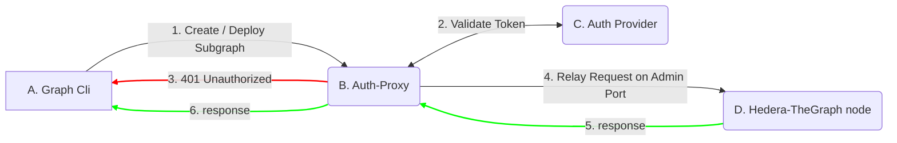

# Hedera-The-Graph Authentication Layer Design Document

## Table of Contents

- [Abstract](#abstract)
- [Motivation](#motivation)
- [User Stories](#user-stories)
- [Design](#design)
    - [A. Graph CLI](#a-graph-cli)
    - [B. Authentication Proxy](#b-authentication-proxy)
    - [C. Authentication Server](#c-authentication-server)
    - [D. Hedera-TheGraph Node](#d-hedera-thegraph-node)

## Abstract 
This document outlines the design for an authentication layer aimed at enabling third-party developers to manage subgraphs on the Hedera-The-Graph node securely. It introduces a mechanism for user authentication and authorized access to the Admin API, which facilitates the creation, deployment, and removal of subgraphs.

## Motivation
Given the absence of an inherent authentication feature in TheGraph server and the support for token-based access in the graph-cli, there's a need for an authentication layer. This layer will ensure that only authorized users can interact with the Hedera-The-Graph node's Admin API, thereby securing the process of managing subgraphs.

## User Stories

- As a subgraph developer, I want to generate an access token to authenticate myself when creating, deploying, or removing subgraphs on the Hedera-The-Graph node.
- As a subgraph developer, I want to securely deploy my subgraphs to the Hedera-The-Graph node, ensuring that only authorized personnel can modify or remove them.
- As an administrator, I need to manage access to the Hedera-The-Graph node's Admin API, allowing only authenticated users to create, deploy, or remove subgraphs.

## Design

The authentication layer is composed of several components, including the authentication server, the authentication proxy, and the graph-cli client. The authentication server is responsible for authenticating users and providing access tokens. The authentication proxy is responsible for forwarding requests to the Hedera-The-Graph node or returning an error if the user is not authenticated. The graph-cli client is a command-line tool that allows users to interact with the Hedera-The-Graph node, including creating, deploying, and removing subgraphs.



It is based on a standard JWT and OAuth 2.0 tokens, and it is designed to be flexible and extensible. The authentication layer will be implemented using the following components:

### A. Graph CLI

Subgraph developers use this command line tool to create, deploy and remove subgraphs on TheGraph node. It allows to include the access token with the `Authorization: Bearer` JWT standard. 

#### Examples:

##### Create Subgraph
```bash
graph create --node http://<graph-node-host>:<admin-port> <subgraph-name> --access-token <access-token>
```

##### Deploy Subgraph
```bash
graph deploy --ipfs http://<ipfs-host>:<ipfs-port> --node http://<graph-node-host>:<admin-port> <subgraph-name> --access-token <access-token>
```

The graph-cli will upload the subgraph artifacts to the IPFS server specified obtaining an IPFS Hash and then will send a request to the node to deploy the subgraph, including the access token in the header.

```HTTP

POST / HTTP/1.1
Content-Length: 214
Content-Type: application/json; charset=utf-8
Accept: application/json
User-Agent: jayson-4.0.0
Authorization: Bearer <access-token>
Host: <graph-node-host>:<admin-port>
Connection: close

{
  "method": "subgraph_deploy",
  "jsonrpc": "2.0",
  "params": {
    "name": "<subgraph-name>",
    "ipfs_hash": "<ipfs-hash>",
    "version_label": "0.0.4"
  },
  "id": "c771f120-fed4-4567-9c57-61d470a4b09c"
}
```

### B. Authentication Proxy

This component is responsible for forwarding requests to the Hedera-The-Graph node or returning an error if the user is not authenticated. The authentication proxy is responsible for validating the access token and forwarding the request to the Hedera-The-Graph node if the user is authenticated. If the user is not authenticated, the authentication proxy returns an error (401 Unauthorized).

**Responsabilities of the `Auth-Proxy` are:**
1. Receive the request from the graph-cli.
2. Parse as a valid JSON-RPC request.
3. Extract the access token from the header.
4. Extract the "method" and "params" from the JSON-RPC request.
5. Validate the access token with the authentication server and get the user's permissions.
6. If the user has the required permissions, forward the request to the Hedera-The-Graph node.
7. If the user does not have the required permissions, return an error (401 Unauthorized).

For the implementation of the `Auth-Proxy` we will use a Envoy Proxy with a custom HTTP filter using LUA Script to validate the access token, and associated permissions.

Environtment variables to configure the `Auth-Proxy`:

- **TOKEN_INTROSPECTION_URL:** needed to validate the access token with the authentication server and retrieve token claims.
- **CLIENT_ID:** needed to identify the application that is verifying the token veracity and claims.
- **CLIENT_SECRET:** needed to authenticate the application that is verifying the token veracity and claims.


### C. Authentication Server

This component is responsible for authenticating users and providing access tokens. The authentication server is responsible for validating the user's credentials and generating an access token. The access token is used to authenticate the user when making requests to the Hedera-The-Graph node. The authentication server will use OAuth2 and JWT standards to provide access tokens, and it will manage the custom claims to define the user's permissions. 

Any authentication server that supports OAuth2 and JWT standards can be used, but for the implementation included on this project we will use a `Keycloak` server, it was chosen because it is a robust OSS Identity Provider that is widely used and has a lot of documentation and community support available and it is easy to integrate with other systems and to manage users, roles, and permissions.

We will be using the following endpoints of the Keycloak server:
- **Token:** `/realms/HederaTheGraph/protocol/openid-connect/token` to obtain the access token.
- **Token Introspect:** `/realms/HederaTheGraph/protocol/openid-connect/token/introspect` to validate the access token and retrieve token claims.

Users permissions will be defined with 5 custom roles: "subgraph_create", "subgraph_deploy", "subgraph_remove", "subgraph_pause" and "subgraph_resume". And with a custom claim called "subgraph_access" that will contain a CSV String with the subgraphs names that the user has access to.

#### Roles: 
1. **subgraph_create:** allows the user to create a new subgraph.
2. **subgraph_deploy:** allows the user to deploy a subgraph.
3. **subgraph_remove:** allows the user to remove a subgraph.
4. **subgraph_pause:** allows the user to pause indexing a subgraph.
5. **subgraph_resume:** allows the user to resume indexing a subgraph.

Each role will enable the user to consume a protected endpoint on the Hedera-The-Graph node's Admin API. There is a 1:1 relationship between the roles and the protected endpoints. 

*The only endpoint that is not supported is `subgraph_reassign` because its use is not recommended and it is not a common operation, besides it does not make sense to reassign a subgraph to another indexer, because by default Hedera-The-Graph node is a single indexer setup.

#### Custom Claims:
- **subgraph_access:** contains a CSV String with the subgraphs names that the user has access to. ie: "subgraph1,subgraph2,subgraph3"

#### Token Request example:

On the example below, the `user` needs to have their email confirmed (activated) and `password` set prior to requesting a token. The `client_id` and the `client_secret` are needed to identify the application within the Keycloak server and would be provided to the developers by the Hedera-The-Graph node administrators. 

*This flow is based on the `password` grant type of the OAuth2 standard included on Keycloak. But different implementations of the `Auth-Server` can use different flows that are more suitable for their needs. Including a GUI Interface to generate an access token.*

```bash
curl --location 'http://host.docker.internal:8080/realms/HederaTheGraph/protocol/openid-connect/token' \
--header 'Content-Type: application/x-www-form-urlencoded' \
--data-urlencode 'grant_type=password' \
--data-urlencode 'username=developer1' \
--data-urlencode 'password=12345' \
--data-urlencode 'client_id=htg-auth-layer' \
--data-urlencode 'client_secret=XVEvWl41OqmGCicoFMrehrqWYQQgUndS'
```

**response:**

On the response below, the `access_token` is a JWT token that contains the user's permissions and the `subgraph_access` claim with the subgraphs names that the user has access to, the token is valid for `36000` seconds but the TTL of the token can be configured on the Keycloak server by the administrators and most likely will be set to a much higher value to be defined.

```json
{
    "access_token": "eyJhbGciOiJSUzI1NiIsInR5cCIgOiAiSldUIiwia2lkIiA6ICI3QmZBRzFodlNib1dETkZlbzFJYTNNa3JUNXBhT2JEbGVNM29SUGVvV3Y0In0.eyJleHAiOjE3MDkxOTYxNzYsImlhdCI6MTcwOTE2MDE3NiwianRpIjoiZmMyYjE3MWMtYmEzMS00NzliLWE3ODUtMjEyZGJkODNiN2EyIiwiaXNzIjoiaHR0cDovL2hvc3QuZG9ja2VyLmludGVybmFsOjgwODAvcmVhbG1zL0hlZGVyYVRoZUdyYXBoIiwiYXVkIjoiYWNjb3VudCIsInN1YiI6ImYwZmEyNGQ2LTgwMWUtNDVhNi04Y2FmLTA4ZThiZWUwYjM4NyIsInR5cCI6IkJlYXJlciIsImF6cCI6Imh0Zy1hdXRoLWxheWVyIiwic2Vzc2lvbl9zdGF0ZSI6IjhhZjc1OGE2LTc5MTgtNDVhYi1iNmRhLWM1MGU2OTg4ODYxZSIsImFjciI6IjEiLCJhbGxvd2VkLW9yaWdpbnMiOlsiLyoiXSwicmVhbG1fYWNjZXNzIjp7InJvbGVzIjpbImRlZmF1bHQtcm9sZXMtaGVkZXJhdGhlZ3JhcGgiLCJvZmZsaW5lX2FjY2VzcyIsInVtYV9hdXRob3JpemF0aW9uIl19LCJyZXNvdXJjZV9hY2Nlc3MiOnsiaHRnLWF1dGgtbGF5ZXIiOnsicm9sZXMiOlsic3ViZ3JhcGhfY3JlYXRlIiwic3ViZ3JhcGhfZGVwbG95Il19LCJhY2NvdW50Ijp7InJvbGVzIjpbIm1hbmFnZS1hY2NvdW50IiwibWFuYWdlLWFjY291bnQtbGlua3MiLCJ2aWV3LXByb2ZpbGUiXX19LCJzY29wZSI6ImVtYWlsIHByb2ZpbGUgc3ViZ3JhcGhfYWNjZXNzIiwic2lkIjoiOGFmNzU4YTYtNzkxOC00NWFiLWI2ZGEtYzUwZTY5ODg4NjFlIiwiZW1haWxfdmVyaWZpZWQiOmZhbHNlLCJuYW1lIjoiRGV2ZWxvcGVyIEV4YW1wbGUiLCJwcmVmZXJyZWRfdXNlcm5hbWUiOiJkZXZlbG9wZXIxIiwiZ2l2ZW5fbmFtZSI6IkRldmVsb3BlciIsImZhbWlseV9uYW1lIjoiRXhhbXBsZSIsImVtYWlsIjoiZGV2ZWxvcGVyMUBnbWFpbC5jb20ifQ.MpmvHDpCjaG5qqRMCpUOvCf4iM0CYWG_POFTK-uHizsD3fWd-nkVLjv35JV5x06PlC6e1QAOoSFFxyxeSZCceu2_8B9IjtTuqic9NvcCd_bX9AG2b5r3Iv5vwC0fyp79sf5_nPd3C-rn92LmJxLdsZLyFKbjGUnshFJn4zeRM8-8nxZ-4e5QKHIPvVIJsU74QliizbvUgFxIg_4tO9azOITSHplR1ztiTuOcHs75YIXX6q3Iox8IDarVhtoM-2GtFg0VSd4hcWNIHB8OyVveM0EKdu7qs7RnCYbRmiAKY1yYL2KyxmaTRg4PHqdkntzjv_wWx8pM2T_zz21yqq9tXA",
    "expires_in": 36000,
    "refresh_expires_in": 1800,
    "refresh_token": "eyJhbGciOiJIUzI1NiIsInR5cCIgOiAiSldUIiwia2lkIiA6ICJiMDI3ZDFjZS1jOTNjLTRiMTQtOTk1MS1jMDAwNzE5YjkyN2YifQ.eyJleHAiOjE3MDkxNjE5NzYsImlhdCI6MTcwOTE2MDE3NiwianRpIjoiMDBhMjkwYTktMjAzMS00ZjZiLTg4OWMtYzAwMzcyNmE1YWFhIiwiaXNzIjoiaHR0cDovL2hvc3QuZG9ja2VyLmludGVybmFsOjgwODAvcmVhbG1zL0hlZGVyYVRoZUdyYXBoIiwiYXVkIjoiaHR0cDovL2hvc3QuZG9ja2VyLmludGVybmFsOjgwODAvcmVhbG1zL0hlZGVyYVRoZUdyYXBoIiwic3ViIjoiZjBmYTI0ZDYtODAxZS00NWE2LThjYWYtMDhlOGJlZTBiMzg3IiwidHlwIjoiUmVmcmVzaCIsImF6cCI6Imh0Zy1hdXRoLWxheWVyIiwic2Vzc2lvbl9zdGF0ZSI6IjhhZjc1OGE2LTc5MTgtNDVhYi1iNmRhLWM1MGU2OTg4ODYxZSIsInNjb3BlIjoiZW1haWwgcHJvZmlsZSBzdWJncmFwaF9hY2Nlc3MiLCJzaWQiOiI4YWY3NThhNi03OTE4LTQ1YWItYjZkYS1jNTBlNjk4ODg2MWUifQ.LzGOag2E5SPHR9L1XL1wlWdue4I4PCI-o7jLXF8to7c",
    "token_type": "Bearer",
    "not-before-policy": 0,
    "session_state": "8af758a6-7918-45ab-b6da-c50e6988861e",
    "scope": "email profile subgraph_access"
}
```

#### Introspect Request example:

```bash

curl --location 'http://host.docker.internal:8080/realms/HederaTheGraph/protocol/openid-connect/token/introspect' \
--header 'Content-Type: application/x-www-form-urlencoded' \
--data-urlencode 'token=eyJhbGciOiJSUzI1NiIsInR5cCIgOiAiSldUIiwia2lkIiA6ICI3QmZBRzFodlNib1dETkZlbzFJYTNNa3JUNXBhT2JEbGVNM29SUGVvV3Y0In0.eyJleHAiOjE3MDkxOTYxNzYsImlhdCI6MTcwOTE2MDE3NiwianRpIjoiZmMyYjE3MWMtYmEzMS00NzliLWE3ODUtMjEyZGJkODNiN2EyIiwiaXNzIjoiaHR0cDovL2hvc3QuZG9ja2VyLmludGVybmFsOjgwODAvcmVhbG1zL0hlZGVyYVRoZUdyYXBoIiwiYXVkIjoiYWNjb3VudCIsInN1YiI6ImYwZmEyNGQ2LTgwMWUtNDVhNi04Y2FmLTA4ZThiZWUwYjM4NyIsInR5cCI6IkJlYXJlciIsImF6cCI6Imh0Zy1hdXRoLWxheWVyIiwic2Vzc2lvbl9zdGF0ZSI6IjhhZjc1OGE2LTc5MTgtNDVhYi1iNmRhLWM1MGU2OTg4ODYxZSIsImFjciI6IjEiLCJhbGxvd2VkLW9yaWdpbnMiOlsiLyoiXSwicmVhbG1fYWNjZXNzIjp7InJvbGVzIjpbImRlZmF1bHQtcm9sZXMtaGVkZXJhdGhlZ3JhcGgiLCJvZmZsaW5lX2FjY2VzcyIsInVtYV9hdXRob3JpemF0aW9uIl19LCJyZXNvdXJjZV9hY2Nlc3MiOnsiaHRnLWF1dGgtbGF5ZXIiOnsicm9sZXMiOlsic3ViZ3JhcGhfY3JlYXRlIiwic3ViZ3JhcGhfZGVwbG95Il19LCJhY2NvdW50Ijp7InJvbGVzIjpbIm1hbmFnZS1hY2NvdW50IiwibWFuYWdlLWFjY291bnQtbGlua3MiLCJ2aWV3LXByb2ZpbGUiXX19LCJzY29wZSI6ImVtYWlsIHByb2ZpbGUgc3ViZ3JhcGhfYWNjZXNzIiwic2lkIjoiOGFmNzU4YTYtNzkxOC00NWFiLWI2ZGEtYzUwZTY5ODg4NjFlIiwiZW1haWxfdmVyaWZpZWQiOmZhbHNlLCJuYW1lIjoiRGV2ZWxvcGVyIEV4YW1wbGUiLCJwcmVmZXJyZWRfdXNlcm5hbWUiOiJkZXZlbG9wZXIxIiwiZ2l2ZW5fbmFtZSI6IkRldmVsb3BlciIsImZhbWlseV9uYW1lIjoiRXhhbXBsZSIsImVtYWlsIjoiZGV2ZWxvcGVyMUBnbWFpbC5jb20ifQ.MpmvHDpCjaG5qqRMCpUOvCf4iM0CYWG_POFTK-uHizsD3fWd-nkVLjv35JV5x06PlC6e1QAOoSFFxyxeSZCceu2_8B9IjtTuqic9NvcCd_bX9AG2b5r3Iv5vwC0fyp79sf5_nPd3C-rn92LmJxLdsZLyFKbjGUnshFJn4zeRM8-8nxZ-4e5QKHIPvVIJsU74QliizbvUgFxIg_4tO9azOITSHplR1ztiTuOcHs75YIXX6q3Iox8IDarVhtoM-2GtFg0VSd4hcWNIHB8OyVveM0EKdu7qs7RnCYbRmiAKY1yYL2KyxmaTRg4PHqdkntzjv_wWx8pM2T_zz21yqq9tXA' \
--data-urlencode 'client_id=htg-auth-layer' \
--data-urlencode 'client_secret=XVEvWl41OqmGCicoFMrehrqWYQQgUndS'
```

**response:**
```json
{
    "exp": 1709196463,
    "iat": 1709160463,
    "jti": "e3c20f5e-cf2d-47ce-be81-ea3edf7d1152",
    "iss": "http://host.docker.internal:8080/realms/HederaTheGraph",
    "aud": "account",
    "sub": "f0fa24d6-801e-45a6-8caf-08e8bee0b387",
    "typ": "Bearer",
    "azp": "htg-auth-layer",
    "session_state": "aa53330d-ff69-4ea5-8b4f-7d49c964740d",
    "acr": "1",
    "allowed-origins": [
        "/*"
    ],
    "realm_access": {
        "roles": [
            "default-roles-hederathegraph",
            "offline_access",
            "uma_authorization"
        ]
    },
    "resource_access": {
        "htg-auth-layer": {
            "roles": [
                "subgraph_create",
                "subgraph_deploy"
            ]
        },
        "account": {
            "roles": [
                "manage-account",
                "manage-account-links",
                "view-profile"
            ]
        }
    },
    "scope": "email profile subgraph_access",
    "sid": "aa53330d-ff69-4ea5-8b4f-7d49c964740d",
    "email_verified": false,
    "name": "Developer Example",
    "subgraph_access": "subgraph1,subgraph2,subgraph3",
    "preferred_username": "developer1",
    "given_name": "Developer",
    "family_name": "Example",
    "email": "developer1@gmail.com",
    "client_id": "htg-auth-layer",
    "username": "developer1",
    "token_type": "Bearer",
    "active": true
}
```

### D. Hedera-TheGraph Node

This component is responsible for indexing data from the Hedera network and storing it in a database. The Hedera-TheGraph node is also responsible for serving queries from the GraphQL API. 

The Admin API of the Hedera-TheGraph node will be reachable only via the `Auth-Proxy` and will require the access token to be included in the header of the requests, and the `Auth-Proxy` will validate the access token and the user's permissions before forwarding the request to the Hedera-TheGraph node.