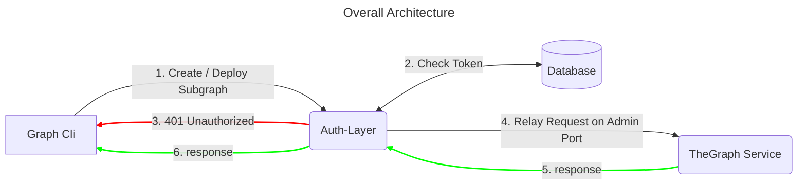

# Readme

This is a POC auth-layer for Hedera-The-Graph implementation that will allow a node operator to publish a secured `admin port` of the-graph deployment for hedera.

Uses EnvoyProxy as a reverse proxy that handles the token verification (auth layer)



## Overview

This is an implementation of EnvoyProxy filters for authentication and authorization. It is a custom config with http filters using Lua scripts for performing the following actions: 

1. JSON Validation
2. Token Extraction
3. Payload Params Extraction
3. Token Validation (using both Postgres or Redis)
4. Proxy Routing Configuration (using EnvoyProxy itself)

it includes a Dockerfile for building the image and a docker-compose file for running the container.

## Pre-requisites

### Postgres
```
docker run --name postgres-envoy-test -e POSTGRES_PASSWORD=mysecretpassword -p 5432:5432 -d postgres
```

Run init script to create the database and the table

```
docker exec -it postgres-envoy-test bash

psql -U postgres

CREATE DATABASE thegraphauth;
\c thegraphauth;

CREATE SCHEMA auth
    AUTHORIZATION postgres;

CREATE TABLE IF NOT EXISTS auth.permissions
(
    id integer,
    token character varying(255) NOT NULL,
    method character varying(50) NOT NULL,
    param_name character varying(50) NOT NULL
);

INSERT INTO auth.permissions(
	id, token, method, param_name)
	VALUES (1, 'Bearer 12345', 'deploy_subgraph', 'test');


```

### Redis

```
docker run --name redis-envoy-test -p 6379:6379 -d redis
```

Run init script to insert token example on redis:

```
docker exec -it redis-envoy-test bash

redis-cli SET "permissions:Bearer 12345:deploy_subgraph:test" "true"
```


## Usage

### Build the image

```bash

docker build -t envoy-auth-layer .

```

### Configure the environment

Add Postgres or Redis credentials to the .env file

```
# Postgres
DB_USER=postgres
DB_PASSWORD=mysecretpassword
DB_HOST=host.docker.internal
DB_PORT=5432
DB_NAME=thegraphauth
# Redis
REDIS_HOST=host.docker.internal
```

### Configure the details of the service to be proxied on the envoy.yaml file

```yaml

                address: host.docker.internal
                port_value: 8020

```


### Run the container

Change the `envoy` configuration file to execute on the command property of the `docker-compose.yaml`, for the desired DB Store of choice.

**For Postgres:**
```
command: -c /configs/envoy-auth-pg-db.yaml

```
**For Redis:**
```
command: -c /configs/envoy-auth-redis.yaml
```

**Start the container:**

```bash

docker-compose up

```

### Test the service

```bash

curl --location 'http://localhost:10000' \
--header 'Content-Type: application/json' \
--header 'Authorization: Bearer 12345' \
--data '{
    "jsonrpc": "2.0",
    "id": "2",
    "method": "deploy_subgraph",
    "params": {
        "name": "test"
    }
}'

```
