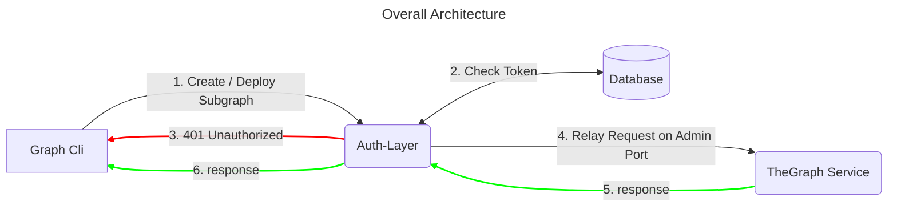

# Readme

This is a token verification auth-layer for Hedera-The-Graph implementation that will allows a node operator to publish a secured `admin port` of the-graph deployment for hedera.

Uses EnvoyProxy as a reverse proxy that handles the token verification (auth layer)



## Overview

This is an implementation of EnvoyProxy filters for authentication and authorization. It is a custom config with http filters using Lua scripts for performing the following actions: 

1. JSON Validation
2. Token Extraction
3. Token Hashing
4. Payload Params Extraction
5. Token Validation using Postgres
6. Proxy Routing Configuration (using EnvoyProxy itself)

it includes a Dockerfile for building the image and a docker-compose file for running the container.

## Pre-requisites

### Postgres
```
docker run --name postgres-envoy-test -e POSTGRES_PASSWORD=mysecretpassword -p 5432:5432 -d postgres
```

Run init script to create the database and the table

```
docker exec -it postgres-envoy-test bash

psql -U postgres

CREATE DATABASE thegraphauth;
\c thegraphauth;

CREATE SCHEMA auth
    AUTHORIZATION postgres;

CREATE TABLE IF NOT EXISTS auth.subgraph_token
(
    id integer,
    email character varying(255) NOT NULL,
    subgraph_name character varying(255) NOT NULL,
    token_hash character varying(65) NOT NULL
);

INSERT INTO auth.permissions(
	id, token, method, param_name)
	VALUES (1, 'Bearer 12345', 'subgraph_create', 'test');

INSERT INTO auth.permissions(
	id, token, method, param_name)
	VALUES (1, 'Bearer 12345', 'subgraph_deploy', 'test');
```

## Usage

### Build the image

```bash

docker build -t envoy-auth-layer .

```

### Configure the environment

Add Postgres or Redis credentials to the .env file

```
# Postgres
DB_USER=postgres
DB_PASSWORD=mysecretpassword
DB_HOST=host.docker.internal
DB_PORT=5432
DB_NAME=thegraphauth
```

### Configure the details of the service to be proxied on the envoy.yam
Edit `envoy-auth.yaml` file with config needs, by default will be proxying/relaying the request to address: `host.docker.internal` and port `8020`

```yaml
  clusters:
  - name: local_service
    connect_timeout: 5s
    type: LOGICAL_DNS
    load_assignment:
      cluster_name: local_service
      endpoints:
      - lb_endpoints:
        - endpoint:
            address:
              socket_address:
                address: host.docker.internal
                port_value: 8020
```


### Run the container


**Start the container:**

```bash
docker-compose up
```

### Test the service

```bash
curl --location 'http://localhost:10000' \
--header 'Content-Type: application/json' \
--header 'Authorization: Bearer 12345' \
--data '{
    "jsonrpc": "2.0",
    "id": "2",
    "method": "deploy_subgraph",
    "params": {
        "name": "test"
    }
}'
```
