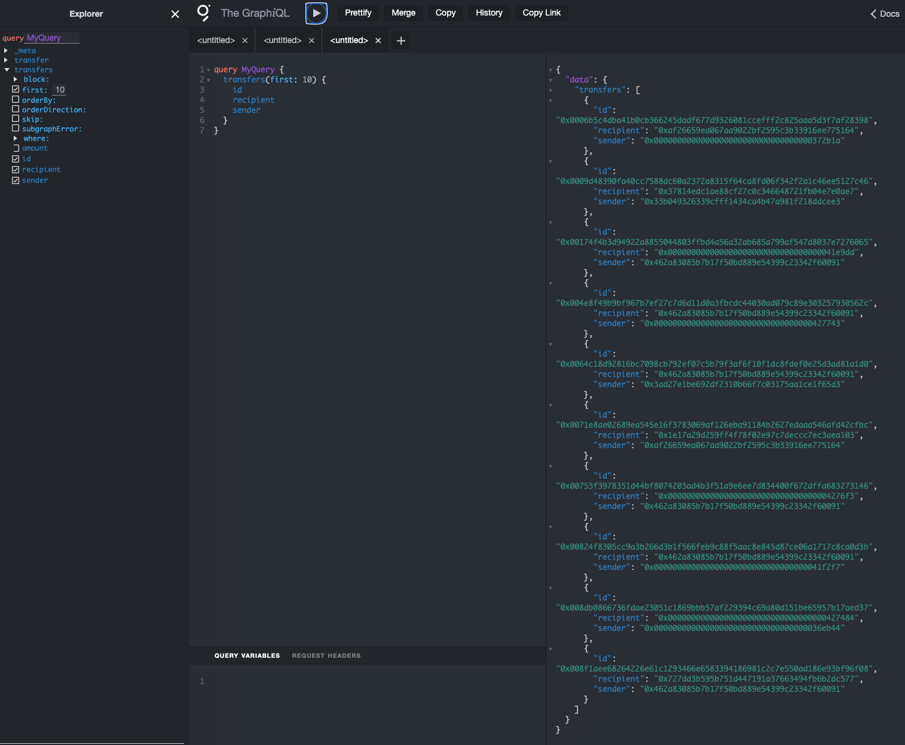

# subgraph-starter-example

This is a starter example for creating a subgraph using the Hedera network. Using the SwirldLabs Hosted TheGraph Service, however you can use any other service that supports TheGraph for deploying the subgraph, or a self hosted service.

It indexes a simple ERC20 (HTS) token transfer events on the Hedera network.
On the following example, we will use `USDC` token contract address on `testnet`.

## Getting Started

### 1. Clone the Repository and copy the Starter Example

Change `your-subgraph-name` to the name of your subgraph.

```bash
# Clone the whole repository
git clone git@github.com:hashgraph/hedera-the-graph.git
# Copy the starter example to your subgraph name folder
cp -r hedera-the-graph/subgraphs/starter-example your-subgraph-name/
# Remove the whole repository
rm -rf hedera-the-graph
# Change directory to your subgraph
cd your-subgraph-name
```


### 2. Update the Environment Variables

Update the `.env` file with the API endpoint and access token, using the auth-server and using credentials provided by the SwirldLabs team.

```bash
cp .env.example .env
```

Your `.env` file should look something like this:

```bash
# .env
# Node Config
HEDERA_THE_GRAPH_NODE=https://testnet-thegraph.swirldslabs.com/manage
IPFS_URL=https://api.thegraph.com/ipfs/
ACCESS_TOKEN=YOUR_ACCESS_TOKEN

# SubGraph Config
SUBGRAPH_CONTRACT_ADDRESS=0x0000000000000000000000000000000000001549 # USDC Token
SUBGRAPH_START_BLOCK=154887 # Block number to start indexing from
SUBGRAPH_NETWORK=testnet # Network to deploy the subgraph on
SUBGRAPH_NAME=erc20-transfers-example # Subgraph name
```

#### Environment Variables

**HEDERA_THE_GRAPH_NODE:** There is a different node for previewnet, testnet or mainnet. These are the API endpoints for deploying it on the SwirldLabs Hosted TheGraph Service.
- Previewnet: `https://previewnet-thegraph.swirldslabs.com/manage`
- Testnet: `https://testnet-thegraph.swirldslabs.com/manage`
- Mainnet: `https://mainnet-thegraph.swirldslabs.com/manage`

**IPFS_URL:** The IPFS endpoint for the IPFS Service that is being currently used. Currently, the SwirldLabs Hosted TheGraph Service uses `https://api.thegraph.com/ipfs/`.

**ACCESS_TOKEN:** The access token for the SwirldLabs Hosted TheGraph Service. You can get it using your provided credentials from the SwirldLabs team.

**SUBGRAPH_CONTRACT_ADDRESS:** The contract address of the ERC20 token you want to index.

**SUBGRAPH_START_BLOCK:** The block number from which you want to start indexing the events.

**SUBGRAPH_NETWORK:** The network on which you want to deploy the subgraph. It can be either:
-  `previewnet`, 
- `testnet` or 
- `mainnet`

Depending on the network you want to deploy the subgraph on, it must correspond to the respective `HEDERA_THE_GRAPH_NODE` endpoint.

**SUBGRAPH_NAME:** The name of the subgraph you want to deploy, your access token should have the required permissions to deploy the subgraph with the provided name.


### 3. Deploy the Subgraph

```bash
npm install
npm run compile
npm run create
npm run deploy
```

### 4. Query the Subgraph

You can query the subgraph using the GraphQL endpoint provided by the SwirldLabs Hosted TheGraph Service.

**Previewnet:** `https://previewnet-thegraph.swirldslabs.com/subgraphs/name/your-subgraph-name/graphql`

**Testnet:** `https://testnet-thegraph.swirldslabs.com/subgraphs/name/your-subgraph-name/graphql`

**Mainnet:** `https://mainnet-thegraph.swirldslabs.com/subgraphs/name/your-subgraph-name/graphql`

*Please refer to #6 example for the query to check a query example using curl, however the links above have a playground that can be used for query builder and execution*



### 5. Check on Indexing Status

You can check the indexing status of the subgraph using the provided GraphQL endpoint.

**Previewnet:** ` https://previewnet-thegraph.swirldslabs.com/graphql`

**Testnet:** ` https://testnet-thegraph.swirldslabs.com/graphql`

**Mainnet:** ` https://mainnet-thegraph.swirldslabs.com/graphql`

*Please refer to #6 example for the query to check the indexing status, a response example and how to interpret the response.*

### 6. Already deployed world example
We have already used this template to deploy `Sauce` Token subgraph on both `testnet` and `mainnet`. You can check the subgraph here:

**Subgraph name:** [`saucerswap/token-sauce-transfers`](https://mainnet-thegraph.swirldslabs.com/subgraphs/name/saucerswap/token-sauce-transfers/graphql)

**Queries:**
- Testnet: https://testnet-thegraph.swirldslabs.com/subgraphs/name/saucerswap/token-sauce-transfers/graphql

- Mainnet: https://mainnet-thegraph.swirldslabs.com/subgraphs/name/saucerswap/token-sauce-transfers

**Indexing Status:**

- Testnet: *same as mainnet, with only difference on url*

- Mainnet: 
    ```bash
    curl -X POST -H "Content-Type: application/json" --data @- https://mainnet-thegraph.swirldslabs.com/graphql <<EOF | jq
    {
        "query": "{
            indexingStatusForCurrentVersion(subgraphName: \"saucerswap/token-sauce-transfers\") {
                health
                synced
                chains {
                    chainHeadBlock {
                        number
                    }
                    latestBlock {
                        number
                    }
                }
                nonFatalErrors {
                    message
                    block {
                        number
                        hash
                    }
                    handler
                    deterministic
                }
                fatalError {
                    message
                    block {
                        number
                        hash
                    }
                    handler
                }
            }
        }"
    }
    EOF    
    ```

    **Indexing Status Response:**
    ```json
    {
        "data": {
            "indexingStatusForCurrentVersion": {
            "health": "healthy",
            "synced": false,
            "chains": [
                {
                "chainHeadBlock": {
                    "number": "63850747"
                },
                "latestBlock": {
                    "number": "62492627"
                }
                }
            ],
            "nonFatalErrors": [],
            "fatalError": null
            }
        }
    }
    ```

    **health:** The health of the subgraph, it can be either `healthy` or `unhealthy`.

    **synced:** The status of the subgraph, it can be either `true` or `false`.

    **chains:** The chain head block and the latest block number that the subgraph is indexing.

    **nonFatalErrors:** The non-fatal errors that the subgraph encountered while indexing.

    **fatalError:** The fatal error that the subgraph encountered while indexing.
